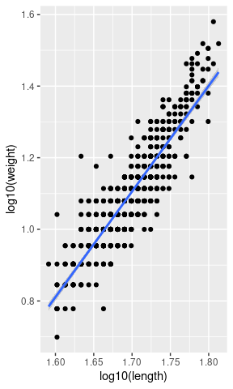

Notebook
================
Roland Knapp
2022-03-04

``` r
library(tidyverse)
```

    ## ── Attaching packages ─────────────────────────────────────── tidyverse 1.3.1 ──

    ## ✓ ggplot2 3.3.5     ✓ purrr   0.3.4
    ## ✓ tibble  3.1.6     ✓ dplyr   1.0.8
    ## ✓ tidyr   1.2.0     ✓ stringr 1.4.0
    ## ✓ readr   2.1.2     ✓ forcats 0.5.1

    ## ── Conflicts ────────────────────────────────────────── tidyverse_conflicts() ──
    ## x dplyr::filter() masks stats::filter()
    ## x dplyr::lag()    masks stats::lag()

## Predictors of frog survival following translocation

### Dataset structure

-   site_id: site to which frogs were translocated
-   elevation
-   date
-   day
-   year
-   donor
-   order: first translocation to site = 0, subsequent translocation = 1
-   type: translocation conducted on foot versus by helicopter (not
    included)
-   shore: suitability of shore/bank habitat for frog overwintering
-   pit_tag_ref
-   survival: individual-level estimated survival 1 year following
    translocation, based on cmr surveys conducted for at least two years
    post-translocation
-   sex
-   length: at release
-   weight: at release
-   condition: index based on length and weight
-   swab_id
-   bd_load: at release

Maximum depth and surface area would seem useful to include, but 74976
is a stream/meadow habitat and as such depth and area at that site are
likely not comparable to depth and area at lake habitats.

Frog condition might be problematic because size and residuals are
correlated. Specifically, the largest frogs have the largest positive
residuals from a weight:length regression line, even after log10
transformation. As such, length and condition are probably not
independent.

``` r
read_csv(here::here("data", "clean", "frog_translocation.csv")) %>% 
ggplot(aes(x = log10(length), y = log10(weight))) +
  geom_point() +
  geom_smooth(method = lm)
```

    ## Rows: 779 Columns: 14
    ## ── Column specification ────────────────────────────────────────────────────────
    ## Delimiter: ","
    ## chr   (2): pit_tag_ref, sex
    ## dbl  (11): site_id, elevation, shore, day, year, order, donor, length, weigh...
    ## date  (1): date
    ## 
    ## ℹ Use `spec()` to retrieve the full column specification for this data.
    ## ℹ Specify the column types or set `show_col_types = FALSE` to quiet this message.
    ## `geom_smooth()` using formula 'y ~ x'



``` r
plot
```

    ## function (x, y, ...) 
    ## UseMethod("plot")
    ## <bytecode: 0x55d4a37e75a0>
    ## <environment: namespace:base>

Another consideration when designing the analysis is that there are 12
records in which bd_load is null. Of these, 9 are from 70413 on
2013-07-15, likely due to a rush to get frogs packaged prior to
helicopter arrival. 39 frogs were translocated on that date, so should
probably drop the 9 records where bd_load = NA prior to running the
analysis. If bd_load is not an important predictor, can run analysis
using the full dataset.

### Model structure

survival \~ elevation + shore + day + year + order + donor + sex +
length + log(bdload) \| site_id

Group-level effects: In addition to the inclusion of site_id as a
group-level effect, may need to include release_year, perhaps nested
within site_id? Given that some sites only have a single release_year,
will this cause problems?

Final steps before building model (in analysis Rmd):

-   Change to factor: order, day?, year?
-   Standardize variables?
-   Survival: Create 0/1 variable from probabilities. Change to factor?
