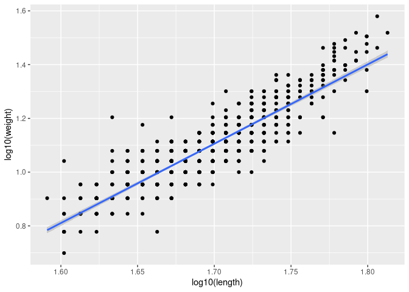

Notebook: Predictors of frog survival following translocation
================
Roland Knapp
2022-06-09

-   <a href="#dataset-structure" id="toc-dataset-structure">Dataset
    structure</a>
-   <a href="#exploratory-analyses"
    id="toc-exploratory-analyses">Exploratory analyses</a>
    -   <a href="#frog-survival-across-recipient-sites"
        id="toc-frog-survival-across-recipient-sites">Frog survival across
        recipient sites</a>
    -   <a href="#donor-site" id="toc-donor-site">Donor site</a>
    -   <a href="#bd-load" id="toc-bd-load">Bd load</a>
    -   <a href="#recipient-site-characteristics"
        id="toc-recipient-site-characteristics">Recipient site
        characteristics</a>
    -   <a href="#translocation-timing"
        id="toc-translocation-timing">Translocation timing</a>
    -   <a href="#winter-severity" id="toc-winter-severity">Winter severity</a>
    -   <a href="#translocation-order"
        id="toc-translocation-order">Translocation order</a>
    -   <a href="#frog-characteristics" id="toc-frog-characteristics">Frog
        characteristics</a>
-   <a href="#analyses" id="toc-analyses">Analyses</a>
    -   <a href="#model-structure" id="toc-model-structure">Model structure</a>
    -   <a href="#dataset-final-steps-before-building-model"
        id="toc-dataset-final-steps-before-building-model">Dataset: Final steps
        before building model</a>
    -   <a href="#priors" id="toc-priors">Priors</a>
-   <a href="#results" id="toc-results">Results</a>

## Dataset structure

-   site_id: site to which frogs were translocated  
-   elevation: water body surface elevation above sea level, in meters  
-   shore: presence/absence of shore/bank habitat available to frogs in
    winter (estimated in late-summer)  
-   snow_t: snow water content (measured on April 1) in year of
    translocation  
-   snow_t1: snow water content (measured on April 1) in year following
    translocation  
-   date: date frogs released at recipient site  
-   year: year frogs released at recipient site  
-   day: day of the year on which frogs were released  
-   order: order of translocations to a site, from 1-4. Re-coded as
    indicator variable (variable name = “first”): 1 = first
    translocation to site; 0 = subsequent translocation  
-   donor: site_id from which frogs were collected for translocation  
-   pit_tag_ref: pit tag id  
-   sex: m or f, re-coded as indicator variable (variable name =
    “male”): 1 = male, 0 = female  
-   length: frog snout-vent length at capture at donor site (in mm)  
-   weight: frog weight at capture at donor site (in grams)  
-   bd_load: number of ITS copies at release, measured from swab
    collected at capture at donor site  
-   survival: individual-level estimated probability of survival 1 year
    following translocation, based on cmr surveys conducted for at least
    two years post-translocation. Re-coded as indicator variable
    (variable name = “surv”): 0 = survival probability \< 0.5; 1 =
    survival probability
    
    0.5)

Other variables \* Maximum depth and surface area would seem useful to
include, but 74976 is a stream/meadow habitat and as such depth and area
at that site are likely not comparable to depth and area at lake
habitats.  
\* Frog condition is problematic because size and residuals from
length:weight regression line are correlated. Specifically, the largest
frogs have the largest positive residuals from a length:weight
regression line, even after log10 transformation. As such, length and
condition are not independent.

<!-- -->

-   Another consideration when designing the analysis is that there are
    12 records in which bd_load is null. Of these, 9 are from 70413 on
    2013-07-15, likely due to a rush to get frogs packaged prior to
    helicopter arrival. 39 frogs were translocated on that date, so
    plenty of swab results are available to represent that site. Prior
    to running the analyses, should drop the 12 records where bd_load =
    NA. If bd_load is not an important predictor, can run analysis
    (without the bd_load predictor) using the full dataset.

## Exploratory analyses

Exploratory data analyses conducted in
translocation_survival_exploratory.Rmd provided several notable
insights.

### Frog survival across recipient sites

-   1-year frog survival is highly variable across sites, but highly
    repeatable within a site. This indicates the importance of including
    site_id or translocation_id as group-level effects. It remains
    unclear whether including a translocation_id nested within site_id
    should be considered (or if this nested group-level effect is even
    feasible given the relatively small number of translocations per
    site).

### Donor site

-   Donor site has a strong association with frog survival, with
    survival at 70459 \> 70567 \> 72996. Explored possible effects of
    bd_load and frog size as drivers of this pattern. Differences in
    survival between donor sites seem unrelated to bd_load, but appear
    closely associated with frog size. Whether frog size is the sole
    driver or is a result of frog size plus other unmeasured donor site
    attributes (e.g., degree of resistance against Bd infection) is
    unknown.
    -   Minimal differences between donor sites in median bd_load, but
        slightly higher at 72996. No obvious effect of bd_load on 1-year
        frog survival.  
    -   Strong effect of frog size on 1-year survival, with frogs \> 55
        mm having substantially higher 1-year survival. Frogs \>60 mm
        had by far the highest survival.  
    -   The effect of frog size on survival appears unrelated to bd_load
        because there is no relationship between frog size and
        bd_load.  
    -   Frog size differs between donor site: size at 72996 \< 70459
        = 70567. This partially mirrors the observed differences in
        survival between sites. Sufficient overlap in frog sizes between
        donor sites that it might be possible to include both frog
        length and donor in the model.

### Bd load

-   Frogs with the highest loads at the time of translocation had the
    lowest survival. The effect was only evident in the category that
    included frogs with loads of 56,000–2,100,000 ITS copies. Notable
    result given that the threshold level of 56,000 copies is /\~ 1
    order of magnitude below the 600,000 copies level associated with
    frog mortality during epizootics.

### Recipient site characteristics

-   **Shore habitat**: The presence of shore habitat is associated with
    increased frog survival. Unknown if this is a direct effect
    reflecting the importance of this habitat type, or if shore habitat
    is serving as a proxy for another habitat feature. Tight association
    between shore habitat presence/absence and elevation will make it
    impossible to disentangle these effects, include only elevation in
    the model.  
-   **Elevation**: Strong positive effect on frog survival.

### Translocation timing

-   Day of the year showed no obvious relationship to frog survival.  
-   Year was positively associated with survival. This is likely not a
    direct effect of year, but instead reflects better-informed
    selection of recipient sites with high-quality frog habitat over
    time. As such, consider not including year in the model.

### Winter severity

-   No obvious relationship between either winter severity in year of
    translocation or in year following translocation on frog survival,
    but some substantial differences in frog survival between winter
    severity categories.

### Translocation order

-   Frogs in the first cohort translocated to a site generally had
    higher survival than frogs in subsequent cohorts. However, effect
    appears relatively weak.  
-   It remains unclear what mechanism could lead to the slightly higher
    mortality of later cohorts.

### Frog characteristics

-   Frog size had strong effect on 1-year survival.  
-   Minimal differences in survival between males and females (slightly
    higher in males).

## Analyses

### Model structure

As originally conceived: survival \~ elevation + shore + snow_t +
snow_t1 + year + day + order + donor + sex + length + log(bdload) \|
site_id

Based on exploratory analyses: survival \~ elevation + snow_t +
snow_t1 + day + order + donor + sex + length + log(bdload) \| site_id

Pairs plot to identify correlations between predictors (ggpairs from
GGally package): \* It may not be possible to include both donor and
length in a single model because the distribution of frog lengths is
quite different across donor sites, causing dependency between donor and
length. As such, these two variables have the potential to compete for
the same variation. Need to look at this more closely, perhaps by
plotting frog lengths at each donor site. Also, plot length against
survival, grouped by donor. Are these distributions as donor-specific as
they appear to be? Because of the importance of distinguishing frog size
effects from other effects associated with donor populations (e.g.,
inherent differences in Bd susceptibility), may need to explore whether
it would be possible to compare the fit of two models, each containing
one of these two variables.  
\* Also need to disentangle elevation from site_id - currently only one
elevation per site_id. Try breaking continuous elevation into
categories, with \> 2 site_ids per category. Hopefully, that will make
elevation variable less dependent on site_id. A similar situation may
exist for the two winter severity variables and site_id.  
\* Shore and elevation may also be closely associated. Are all sites
with shore = 0 at low elevation? If so, may need to only include
elevation in model.

Group-level effects: The dataset has three sources of hierarchical
structure: site_id, translocation_id, and donor site. Donor site is not
suitable as a grouping variable because there are only 3 levels (i.e.,
site ids), not enough to make this useful. Site_id and translocation_id
contain 12 and 24 levels, respectively, making them suitable as grouping
variables. Including both site_id and translocation_id as nested
grouping variables (i.e., translocations nested within site ids) also
seems justified. Having more levels within a group would seem to
increase the power to detect effects of predictors. With fewer
levels/less variability, effect may be accounted for primarily by
grouping variable itself instead of an associated predictor (e.g.,
elevation is closely associated with both site_id and translocation_id).
With only 1-4 translocations per site and only 12 site ids total, it is
possible that a model with site_id as sole grouping variable or a model
with site_id and translocation_id as nested grouping variables will both
attribute more of the variation in frog survival to the grouping
variables and less to the predictors. A priori, that would suggest that
the model with translocation_id as the grouping variable might be the
most useful model structure (assuming that all models have similar
posterior predictive accuracy). Lacking any strong rationale for one
model structure over another, build 3 models and compare their posterior
predictive accuracy using loo.

Interactions between predictor variables: General guidance is that
interactions between the most important predictors should be included in
model.

### Dataset: Final steps before building model

-   Bin elevation into “low” and “high” groups.  
-   Recode order as 0/1 (instead of 1–4): “first”.  
-   Recode survival as 0/1 (instead of continuous probability):
    “surv”.  
-   Recode binary variables as 0/1 indicators: elevation (“elev_lo”),
    sex (“male”). See Gelman reference below.  
-   Format relevant variables as factors: surv, elev_lo, shore, first,
    donor, male, year, site_id, translocation_id.  
-   Standardize continuous variables: elevation, snow_t, snow_t1, day,
    length. Possibly standardize log(bd_load) also, but see Gelman for
    recommendations. Gelman recommends centering by subtracting the mean
    and standardizing by dividing by 2 standard deviations. Centering to
    a mean of 0 makes interactions more interpretable. Standardizing
    allows assessment of importance of predictors by comparing
    regression coefficients. Dividing by 2 SD puts continuous variables
    on approximately the same scale as binary (0/1) variables. This is
    true only if binary predictors have similar number of 0s and 1s. In
    the current dataset, there is some deviation from 1:1. Sex: female =
    428, male = 351; order: 0 = 507, 1 = 272. Binary variables should be
    centered but not standardized. Variables in need of
    log-transformation should be transformed and then rescaled, although
    rescaling will not always be necessary.

Relevant references:  
\* Gelman 2008: <https://doi.org/10.1002/sim.3107>  
\* Schielzeth 2010: <https://doi.org/10.1111/j.2041-210X.2010.00012.x>

### Priors

-   For regression coefficients in logistic regression: A recommended
    weakly informative prior is beta \~ student_t(nu,0,s), where s is
    chosen to provide weak information on the expected scale, and
    3\<nu\<7.
    <https://github.com/stan-dev/stan/wiki/Prior-Choice-Recommendations>.  
-   Other recommendations in:
    -   Moving beyond noninformative priors: why and how to choose
        weakly informative priors in Bayesian analyses:
        <https://doi.org/10.1111/oik.05985>.  
    -   Choosing priors in Bayesian ecological models by simulating from
        the prior predictive distribution:
        <https://doi.org/10.1002/ecs2.3739>.

## Results

-   Important predictors of the 1-year survival of translocated frogs
    were quite consistent across all models (see
    `translocation_analysis_survival.Rmd` for details).  
-   In the “best” model that included standardized predictors and
    translocation_id as a grouping variable, important predictors
    included elevation (+), winter severity in the year following
    translocation (-), and donor\[72996\] (-). Model R2 was 0.32, so a
    substantial amount of variation remained unaccounted for.  
-   Comparison of different grouping structures (translocation_id,
    site_id, translocation_id nested within site_id) indicated that all
    had similar posterior predictive accuracy. However, using
    translocation_id as the grouping variable allowed greater insights
    into the effects of the predictor variables, presumably due to the
    greater variation associated with the translocation_id grouping
    variable (n = 24) compared to the site_id grouping variables (n =
    12).  
-   Posterior predictive accuracy of “best” model was 0.79, and the true
    negative rate (proportion of frogs that did not survive that were
    accurately classified as not surviving: 0.88) was higher than the
    true positive rate (proportion of frogs that survived that were
    accurately classified as surviving: 0.59). Indicates that with the
    available site-level and frog-level predictors, frog non-survival is
    more accurately predicted than frog survival. This is borne out by
    sites such as 70370 which has attributes suggesting high frog
    survival (e.g., high elevation, available bank habitat, few
    predators), but in fact frogs from both translocations experienced
    very low survival. In contrast, no examples exist of sites where
    frog survival was (retrospectively) predicted to be low, but actual
    survival was high (although 70449 comes closest to providing such an
    example).  
-   Two supplementary analyses were conducted to gain additional
    insights into the 1-year survival model.
    -   Because the three donor populations differed in the size of
        collected/translocated frogs, frog size was potentially
        associated with the important effect of donor population.
        Therefore, I reran the analysis using only frogs translocated
        from 72996. Despite substantial variation in the size of frogs
        collected/translocated from this site, results indicated that
        frog size was unrelated to frog survival. This suggests that the
        effect of donor population is due to an unmeasured
        population-level attribute, e.g., a characteristic associated
        with frog resistance/tolerance of Bd infection. The existence of
        such an attribute is suggested by the consistently high survival
        resulting from the four translocations conducted to date from
        70459 to two very different sites, and the fact that in both
        recipient sites that have received frogs from 70459 tadpole
        mouthparts are fully pigmented. That is not the case with
        tadpoles at sites that received frogs from 72996.  
    -   The frog translocation dataset contained 12 records for which
        bd_load = NA. To allow inclusion of bd_load in the model, these
        12 records were dropped. Given that bd_load was not an important
        predictor of frog survival, I reran the model using the complete
        dataset and dropping bd_load from the model. Dropping/including
        those 12 records had no effect on model results.  
-   The results from a secondary analysis to complement the 1-yr
    survival model demonstrated that the average survival in the first
    translocation was an important predictor of frog survival in
    subsequent translocations. This demonstrates the importance of
    recipient site attributes (elevation, habitat, predators, etc.) in
    determining frog survival.
